# FlavorFly - Food Ordering App

FlavorFly is a full-stack food ordering application built with ReactJS, Tailwind CSS, Firebase, and Stripe API for payments.

## Description

FlavorFly is designed to provide users with a seamless food ordering experience. Users can browse through various menu items, add them to their cart, and proceed with secure payments using Stripe API. The app also includes user authentication using Firebase, supporting both Google sign-in and email/password authentication.

## Technologies Used

- **Frontend**: ReactJS, Tailwind CSS
- **Backend**: Firebase (Database, Storage, Authentication)
- **Payment**: Stripe API

## Features and Usage

- **Login Page**: Users can sign in using Google or their email/password and create an account.
- **Home Page**: Displays featured items and promotions.
- **Showcase Items**: Displays a selection of popular food items.
- **Menu**: Users can browse through the complete menu.
- **Services**: Includes an innovative idea for catering services:
  - **Catering for Big Events**: Users can see the list of available restaurants in their area that cater to big events, providing menu options, contact details, location, pricing, and delivery information.
- **About Us Section**: Details about the company and its mission.
- **Create Container Page**: Admin can sdd new menu items.
- **Empty Cart**: Displayed when the cart is empty.
- **Cart**: Manage selected items and quantities in the cart.
- **Payment Page**: Secure checkout process using Stripe API.
- **Payment Successful Page**: Confirmation of successful payment.
- **Payment Failed Page**: Notification in case of payment failure.
- **Payment Details Page**: Detailed information about the payment in Stripe.
- **Checkout Summary Page**: Summary of items and total cost after payment in Stripe.
- **Stripe Payments & Customer Details**: Integration with Stripe for secure payments and customer information.
- **Firebase Database**: Stores user and order data securely.
- **Firebase Authentication**: Supports Google sign-in and email/password authentication.

## Screenshots

### Login Page
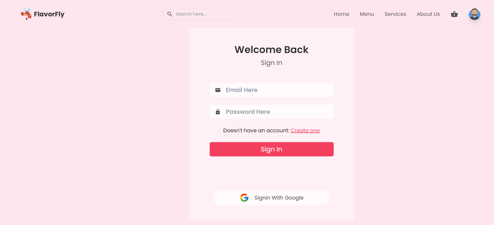

### Home Page
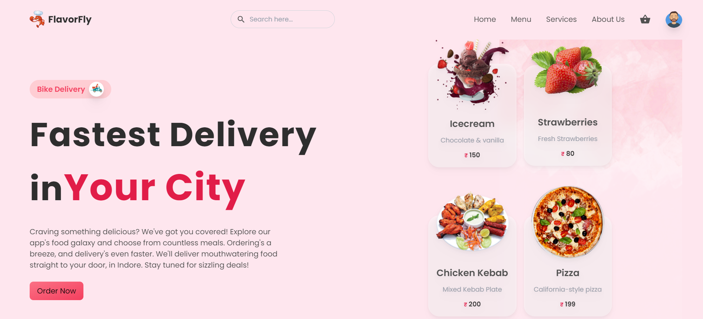

### Showcase Items
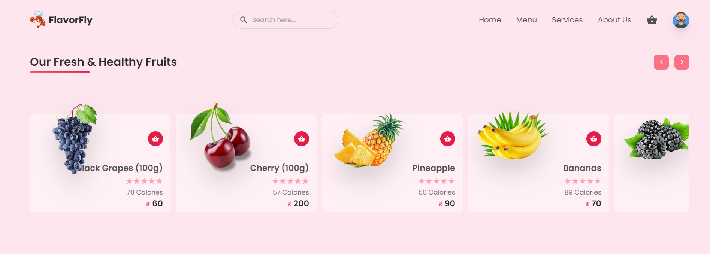

### Menu
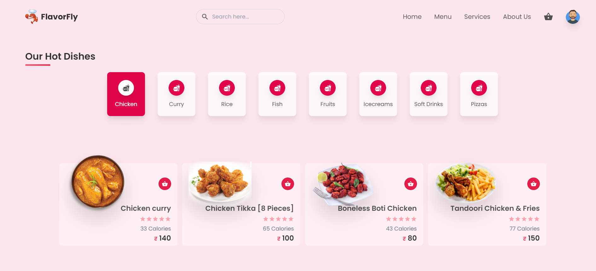

### Services
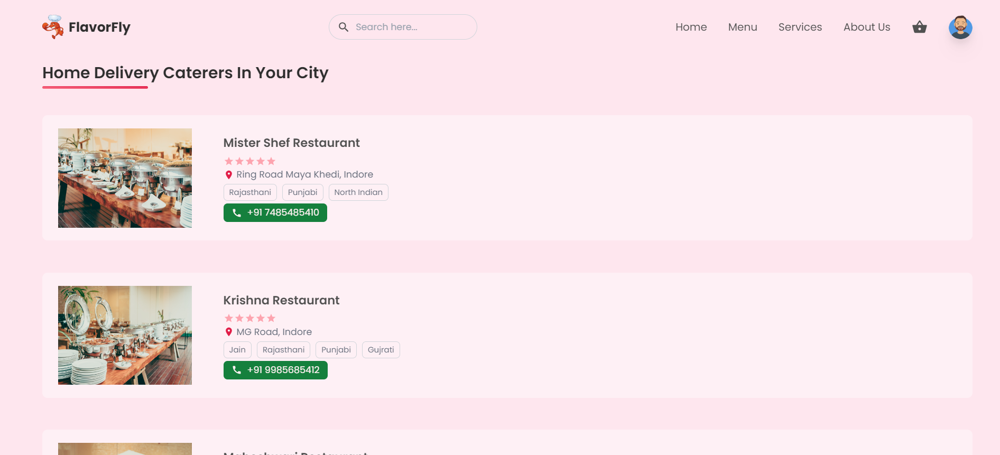

### About Us
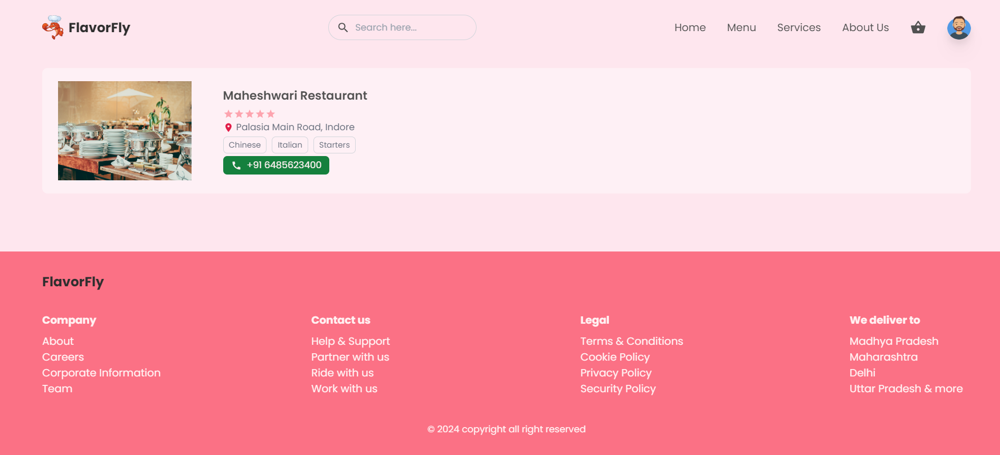

### Create Container Page
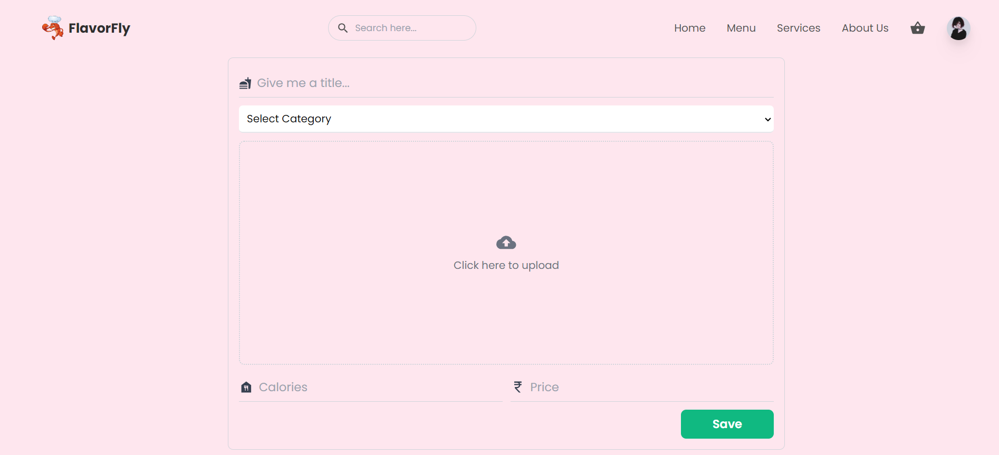

### Empty Cart Page
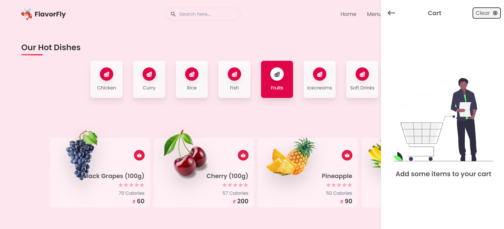

### Cart Page
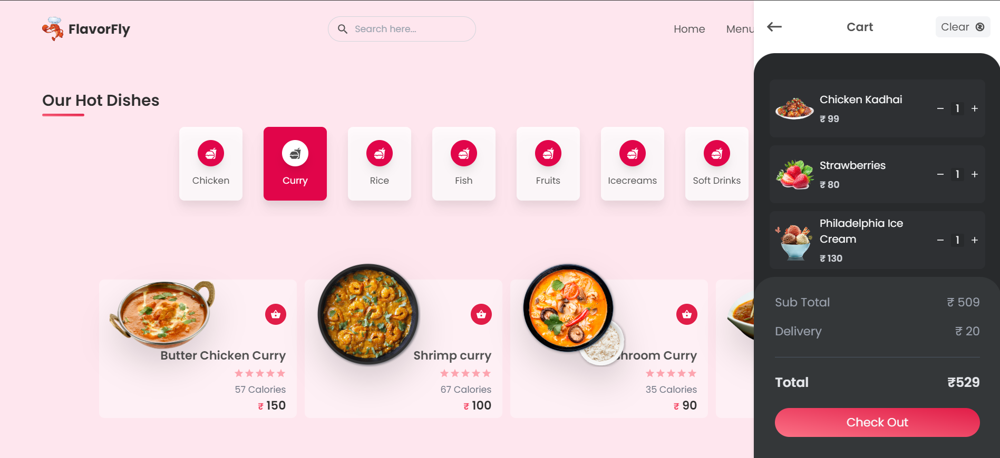

### Payment Page
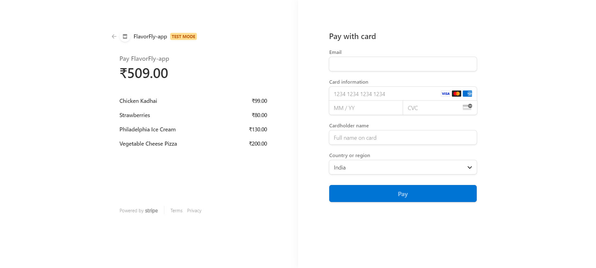

### Payment Successfull Page
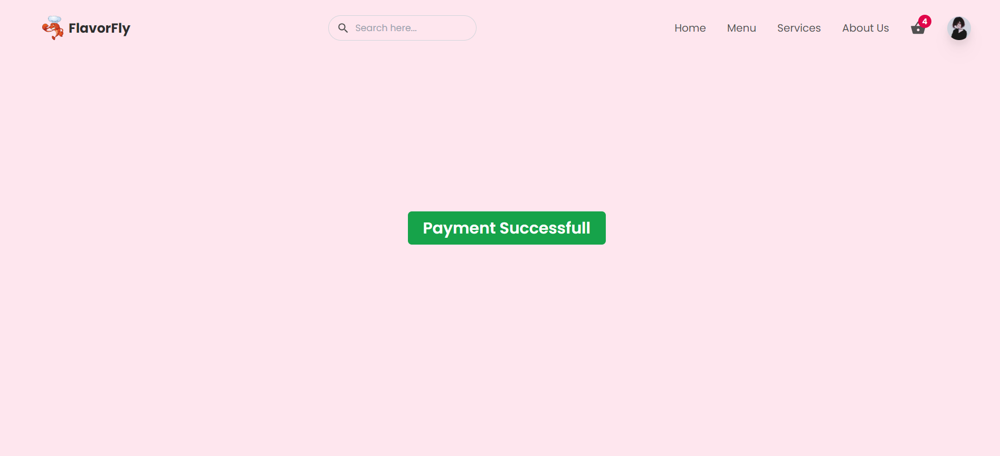

### Payment Failed Page
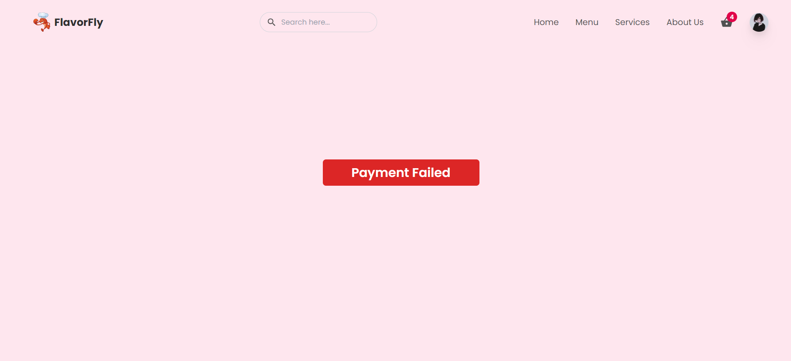

### Payment Details Page
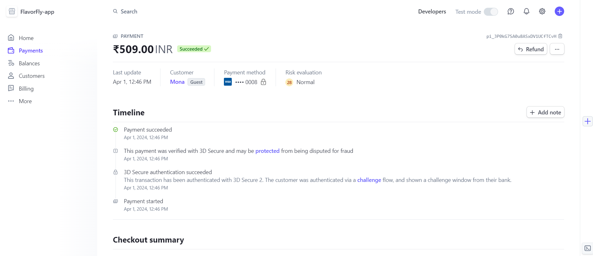

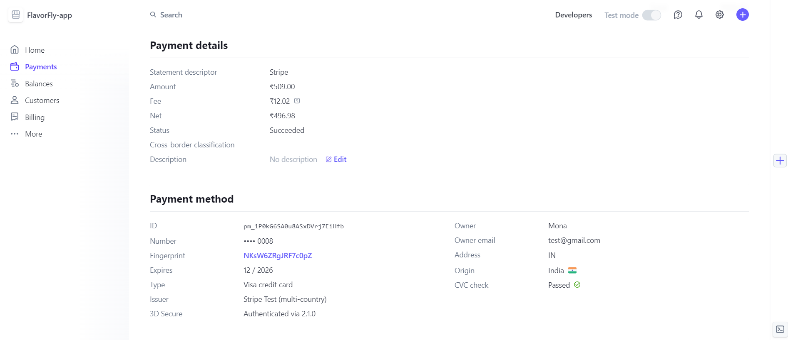

### Checkout Summary
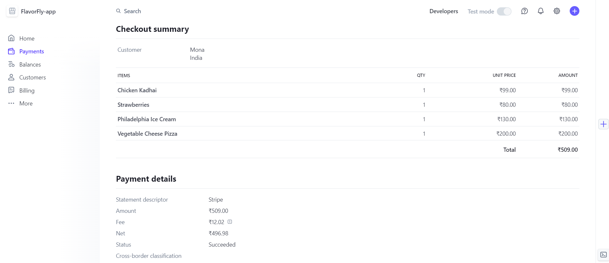

### Stripe Payments & Customer Details
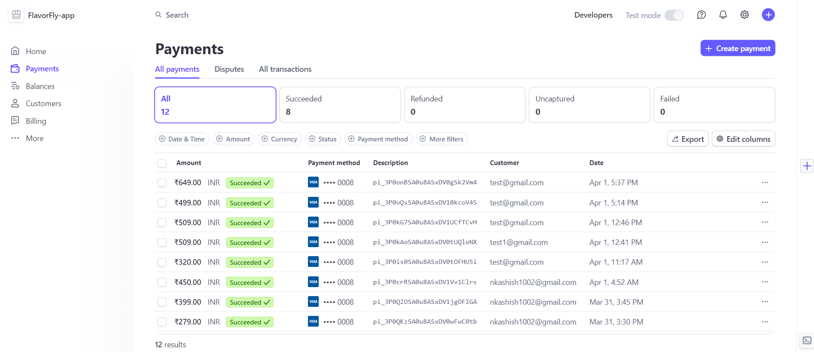

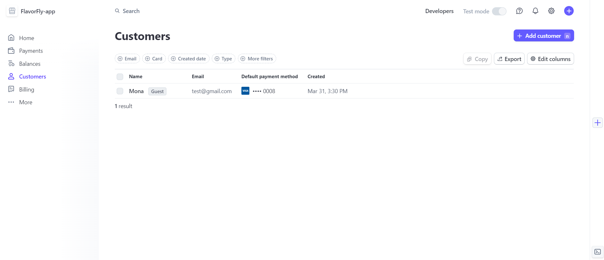

### Firebase Database
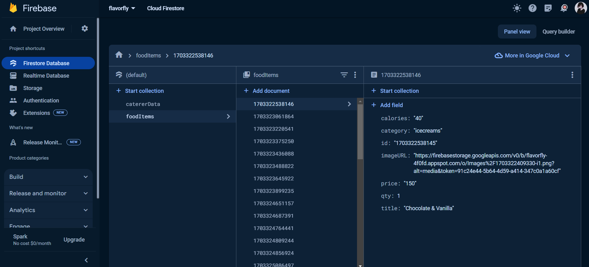

### Firebase Authentication
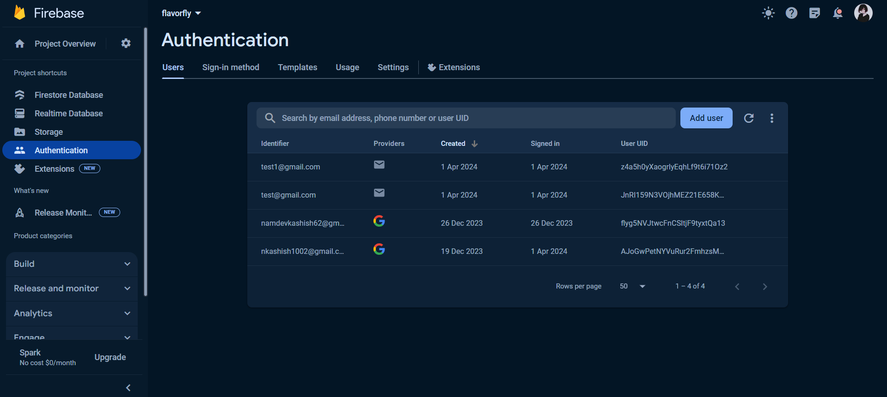

## Getting Started

1. Clone the repository: `git clone https://github.com/yourusername/flavorfly.git`
2. Navigate to the project directory: `cd flavorfly`
3. Install dependencies: `npm install`
4. Set up Firebase:
   - Create a Firebase project and obtain your Firebase configuration.
   - Add the Firebase configuration to `src/firebase.js`.
5. Set up Stripe API:
   - Obtain your Stripe public key and add it to `src/components/CheckoutForm.js`.
6. Start the development server: `npm start`
